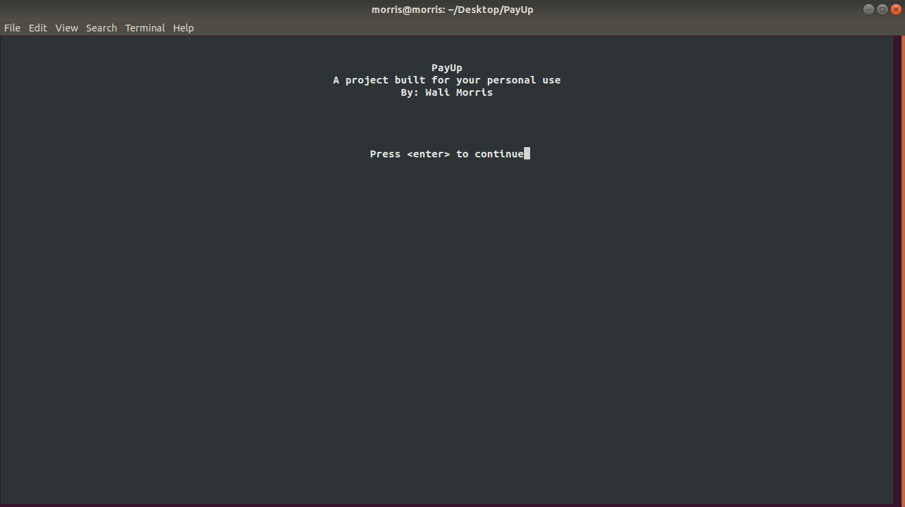

# Payup

A C project
By: Wali Morris 

NOTE: This is my first, small, C programming project after a few weeks of self study.
I wanted to put the things I've learned to the test. I'm still getting the hang of C,
although I do enjoy using it as a programming lanaguage. It can be really tricky at times. 

"They" say, in the beginning, to make things that you can use daily. So, here it is, a 
program that'll perform daily bill notification pop ups directly on  my personal PC. 
I ran into the ncurses library and figured I'd give it a shot. One of my goals is to 
become very comfortable in a Linux environment, so some of my first programs have 
utilized command line protocols and libraries, like ncurses and TCP utilities.

This program is mainly the setup for the pop-up notification, where I'll then use the notify-send 
command in a small script to automate the dailey notifications. Notify send is a cool Linux command
I ran into after researching more online about C. This features allows you to communicate with your 
Linux system to send sweet pop-up notifications. This should already be installed on your Linux system. 
If not, you can use: 

UBUNTU: sudo apt-get install notify-osd
DEBIAN: apt-get install libnotify-bin
NOTICE: I ran the second command on my machine running UBUNTU 18.04 and everything is still in tact. 

On the command line: notify-send "Hello, World!"
In a c-program, you'll need to use the \" escape character followed by \ escape and two double quotes
to close the command before sending it off to your system to send that sweet pop-up notification. 
* You can view an example found in the destop_popup.c file.

You'll need to link lncurses when you compile or else gcc will throw a laundry list of errors. 
To compile a C program with ncurses, it should look like this (PayUp.c as example): 
gcc PayUp.c -o PayUp -lncurses

To run: 
./PayUp

 

