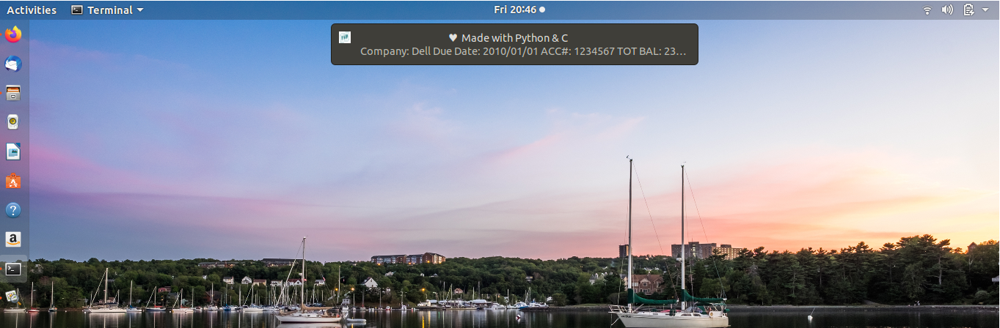
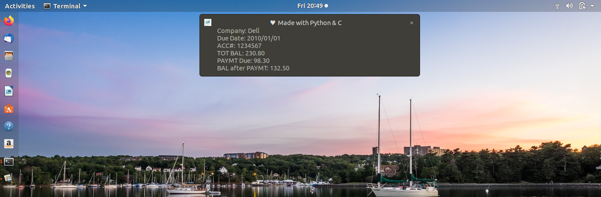

# Payup: A small desktop notification program  
By: Wali Morris 
Dec 22, 2019

NOTICE: This is my first, small, C programming project after a few weeks of self study.
I wanted to put the things I've learned to the test. I'm still getting the hang of C,
although I do enjoy using it as a programming lanaguage. It can be really tricky at times. 
There is also a small Bash and Python script to automate a few processes for this program. 
Getting the hang of Bash was more exciting than I thought it would be, it's actually a 
pretty language and allows a great amount of expression which I thought would be 
perfect for what it's used for. I expanded this program with Python to format the desktop 
notification, which completes its role well. This project is not fully complete and will 
be something I update as I learn more about utilizing the Linux command line, and the 
languages I've used in this project. 

ADDITIONS: There's a lot to be updated to make this project exactly as I want it. My goal
is to make this project easy to use, if anyone other than myself happens to use Payup.
Please refer to the issues page for more details. 

"They" say, in the beginning, to make things that you can use daily. So, here it is, a 
program that'll perform daily bill notification pop ups directly on  my personal PC. 
I ran into the ncurses library and figured I'd give it a shot. One of my goals is to 
become very comfortable in a Linux environment, so some of my first programs have 
utilized command line protocols and libraries, like ncurses, TCP utilities, and notify2.

Most of Payup is written in C. Python is used to set up pop-up notifications, where the notify-send 
command is used. Bash is used to automate periodically sending the desktop notifications with the nohup
command (short for no hangup) that will allow the process to hang. Unless notifications are sent in short
increments, it won't interrupt run time or process speed. After this program is run you'll see a file 
within the directory this program lives that's called nohup.out, you can view this with: 
`vi nohup.out`
Alternatively you can view present and past processes with: 

`lsof | grep nohup.out` 

Notify send is a cool Linux command I ran into after researching more online about C. This features 
allows you to communicate with your Linux system to send sweet pop-up notifications. This should 
already be installed on your Linux system. If not, you can use: 

* UBUNTU: `sudo apt-get install notify-osd`

* DEBIAN: `apt-get install libnotify-bin`

NOTICE: I ran the second command on my machine running UBUNTU 18.04 and everything is still in tact. 

On the command line: 

`notify-send "Hello, World!"`

In a c-program, you'll need to use the \" escape character followed by \ escape and two double quotes
to close the command before sending it off to your system to send that sweet pop-up notification. 
You can view an example found in the desktop_popup.c file.

You'll need to link ncurses when you compile or else gcc will throw a laundry list of errors. 
To compile a C program with ncurses, it should look like this (Payup.c as example): 

`gcc Payup.c -o Payup -lncurses`

TO RUN: 
All of the dependencies are automated through the bash script on run up to ease the process, if Payup is 
run for the first time, the program will be compiled and all scripts will be made executable. 
* Please see Instructions below 


 
 Payup Notifications
 
 
Notify2 is a tool brought to the community by the developers of the @Galago framework. The lead developer 
is @Christain Hammond. Galago, and notify2, is described as a desktop presence framework, designed to transmit 
presence information between programs. Saying that, this is how I've planned building the information processing 
with C and ncurses then using a small Python3 script to use notify2 for the desktop notifications. There are many 
features to use with notify2 and I've barely touched the surface with Payup. So, Thank you to Christain and his team! 

Installing notify2 from the command line and viewing examples: 

`sudo apt install python3-notify 2`

Once installed you can view examples here: `/usr/share/doc/python3-notify2/examples/`




INSTRUCTIONS: 

From the command line:
```
mkdir <dir>
cd <dir>
git clone https://github.com/walimorris/Payup.git
cd Payup 
chmod +x pop.sh
nohup ./pop.sh & 
```
